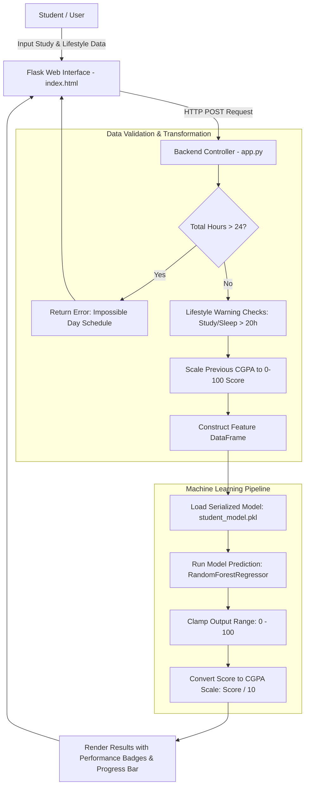

# 🎓 AI Student Performance & CGPA Predictor

<p align="center">
  
  
  
  
  
  
</p>

<p align="center">
  <strong>An end-to-end Machine Learning web application designed to forecast student academic performance and estimate CGPA using academic history and lifestyle metrics.</strong>
</p>

---

## 📌 Table of Contents

- [Overview](#-overview)
- [Key Features](#-key-features)
- [System Architecture](#-system-architecture)
- [Dataset & Feature Description](#-dataset--feature-description)
- [Machine Learning Model](#-machine-learning-model)
- [Project Directory Structure](#-project-directory-structure)
- [Getting Started](#-getting-started)
  - [Prerequisites](#prerequisites)
  - [Installation & Setup](#installation--setup)
  - [Running the Application](#running-the-application)
- [Model Training & Pipeline](#-model-training--pipeline)
- [Deployment](#-deployment)
- [Validation & Edge-Case Handling](#-validation--edge-case-handling)
- [Future Enhancements](#-future-enhancements)
- [Author & Acknowledgments](#-author--acknowledgments)

---

## 📖 Overview

The **AI Student Performance Predictor** is a data-driven web platform that enables students, educators, and mentors to predict expected academic results based on study habits, past performance, and lifestyle routines. 

Trained on a comprehensive dataset of student metrics, the system implements a predictive regression model packaged into a responsive Flask web service with a modern glassmorphic interface, dynamic progress indicators, and health-conscious validation rules.

---

## ✨ Key Features

- **🎯 Accurate CGPA & Score Estimation:** Predicts student performance on a 100-point scale and converts it seamlessly to standard 10.0 CGPA grading.
- **🛡️ Smart Data Validation & Safeguards:**
  - **Hard Constraints:** Rejects illogical inputs (e.g., total study + sleep hours exceeding 24 hours in a single day).
  - **Soft Lifestyle Warnings:** Flags unhealthy habits (e.g., studying or sleeping $>20\text{ hours/day}$).
- **🎨 Glassmorphism & Animated UI:** Built with animated multi-tone gradient backgrounds, frosted-glass cards, and mobile-friendly responsive components.
- **📊 Tier-Based Visual Analytics:** Dynamic color-coded performance bands:
  - 🟢 **$\ge 8.0$ CGPA:** *Excellent Performance*
  - 🟡 **$6.0 - 7.99$ CGPA:** *Good Performance*
  - 🟠 **$4.0 - 5.99$ CGPA:** *Average Performance*
  - 🔴 **$< 4.0$ CGPA:** *Needs Improvement*
- **🚀 Production-Ready Architecture:** Configured with `Procfile` and `Gunicorn` WSGI server for seamless deployment on platforms like Render, Heroku, or Railway.

---

## 🏗️ System Architecture



---

## 📊 Dataset & Feature Description

The model utilizes student data encompassing academic indicators and daily behavioral factors:

| Feature Name | Type | Unit / Range | Description |
| :--- | :--- | :--- | :--- |
| **Hours Studied** | Continuous / Integer | $1 - 24\text{ hrs}$ | Daily time dedicated to self-study and learning |
| **Previous Scores** | Continuous / Float | $0 - 100\text{ marks}$ (or $0.0 - 10.0\text{ CGPA}$) | Academic score achieved in preceding assessments |
| **Extracurricular Activities** | Categorical / Binary | `Yes` ($1$) / `No` ($0$) | Active involvement in sports, clubs, or arts |
| **Sleep Hours** | Continuous / Integer | $0 - 24\text{ hrs}$ | Average daily sleep duration |
| **Sample Question Papers Practiced** | Discrete / Integer | $0 - 10+$ | Number of mock/sample papers completed |
| **Performance Index (Target)** | Continuous / Float | $10.0 - 100.0$ | Overall academic outcome index |

---

## 🧠 Machine Learning Model

- **Primary Algorithm:** `RandomForestRegressor` (`n_estimators=200`, `max_depth=10`, `random_state=42`) / `LinearRegression` baseline.
- **Preprocessing:** Categorical mapping for binary variables (`Yes/No` $\to$ `1/0`) and standard train-test splitting ($80/20$ ratio).
- **Serialization:** Exported via `joblib` into a lightweight, deployable `student_model.pkl` binary.

---

## 📂 Project Directory Structure

```text
Student-Performance-Prediction/
│
├── static/
│   └── style.css                 # Glassmorphism UI styling & animated CSS gradients
├── templates/
│   └── index.html                # Jinja2 template with dynamic alerts & progress meters
├── Student_Performance.csv       # Raw 10,000-record student benchmark dataset
├── Student_Performance.xls       # Excel formatted reference dataset
├── student data.ipynb            # Exploratory Data Analysis (EDA) & baseline experimentation
├── train_model.py                # Model training & serialization pipeline
├── student_model.pkl             # Trained Scikit-Learn model binary artifact
├── app.py                        # Flask server containing business logic & inference engine
├── requirements.txt              # Core project dependencies
├── Procfile                      # WSGI process manager config for cloud deployment
└── README.md                     # Comprehensive project documentation
```

---

## 🚀 Getting Started

Follow these steps to set up and run the application locally on your machine.

### Prerequisites

- **Python 3.9+** installed on your system.
- `git` installed.

### Installation & Setup

1. **Clone the Repository:**
   ```bash
   git clone https://github.com/avinashbasani132/Student-Performance-Prediction.git
   cd Student-Performance-Prediction
   ```

2. **Create and Activate a Virtual Environment:**
   - **Windows (PowerShell):**
     ```powershell
     python -m venv venv
     .\venv\Scripts\Activate.ps1
     ```
   - **Linux / macOS:**
     ```bash
     python3 -m venv venv
     source venv/bin/activate
     ```

3. **Install Required Packages:**
   ```bash
   pip install -r requirements.txt
   ```

### Running the Application

1. **Launch the Flask Development Server:**
   ```bash
   python app.py
   ```

2. **Access the Web Interface:**
   Open your browser and navigate to:
   ```text
   http://127.0.0.1:5000/
   ```

---

## 🔄 Model Training & Pipeline

If you wish to re-train the model on updated datasets or tune hyperparameters:

1. Ensure `Student_Performance.csv` is in the root directory.
2. Run the training script:
   ```bash
   python train_model.py
   ```
   *(Or open `student data.ipynb` in VS Code / Jupyter Lab to inspect EDA visuals, scatter plots, and correlation metrics).*
3. The script will export a new `student_model.pkl` ready for immediate consumption by `app.py`.

---

## ☁️ Deployment

The project is pre-configured for one-click deployment across major cloud providers:

### Deploying to Render / Railway

1. Push your repository to GitHub.
2. Create a **New Web Service** and link your GitHub repository.
3. Configure the build parameters:
   - **Environment:** `Python 3`
   - **Build Command:** `pip install -r requirements.txt`
   - **Start Command:** `gunicorn app:app`
4. Click **Deploy**.

### Deploying to Heroku

```bash
heroku login
heroku create student-performance-predictor-ai
git push heroku main
heroku open
```

---

## 🛡️ Validation & Edge-Case Handling

| Scenario | Input Condition | Application Behavior |
| :--- | :--- | :--- |
| **Impossible Day Schedule** | $\text{Study Hours} + \text{Sleep Hours} > 24$ | Displays red error banner: *"In a day, there are only 24 hours."* (Prediction blocked) |
| **Excessive Study Warning** | $\text{Study Hours} > 20$ | Generates yellow advisory warning regarding burnout & health |
| **Excessive Sleep Warning** | $\text{Sleep Hours} > 20$ | Generates yellow advisory warning regarding sleep schedule |
| **Score Boundary Clamping** | Model raw output $<0$ or $>100$ | Automatically clipped to $[0, 100]$ to prevent invalid CGPA scores |

---

## 🔮 Future Enhancements

- [ ] **SHAP / LIME Interpretability:** Provide personalized feedback on which factors most influenced the student's prediction.
- [ ] **Custom Study Plan Generator:** Generate an AI-suggested revision and sleep routine based on target CGPA goals.
- [ ] **Multi-Subject Deep-Dive:** Predict scores on a per-subject basis with historical trend charts.
- [ ] **RESTful API Endpoint (`/api/v1/predict`):** Provide JSON API responses for mobile app integrations.

---

## 👨‍💻 Author & Acknowledgments

- **Developed by:** [Avinash Basani](https://github.com/avinashbasani132)
- **Dataset:** Student Performance Dataset ([Kaggle](https://www.kaggle.com/))
- **Libraries:** Flask, Scikit-Learn, Pandas, Joblib, Gunicorn

---

<p align="center">
  <sub>⭐ If you find this repository helpful, please consider starring the project on GitHub!</sub>
</p>
